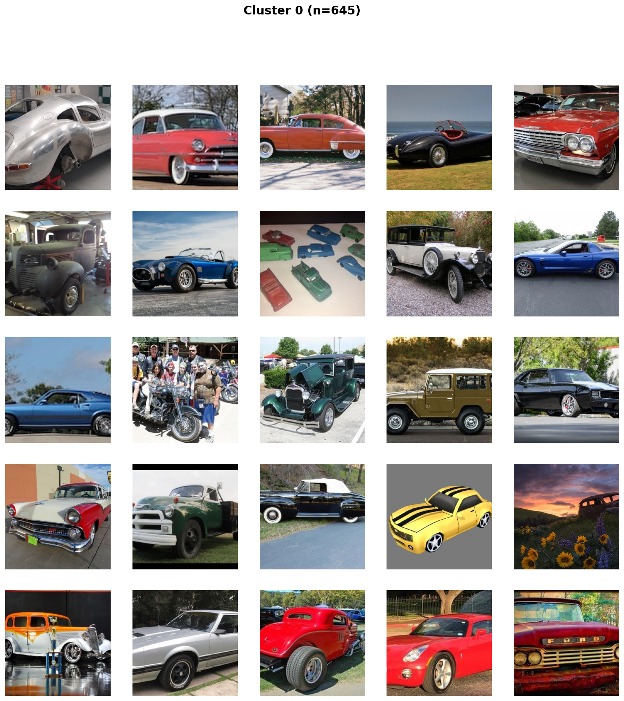
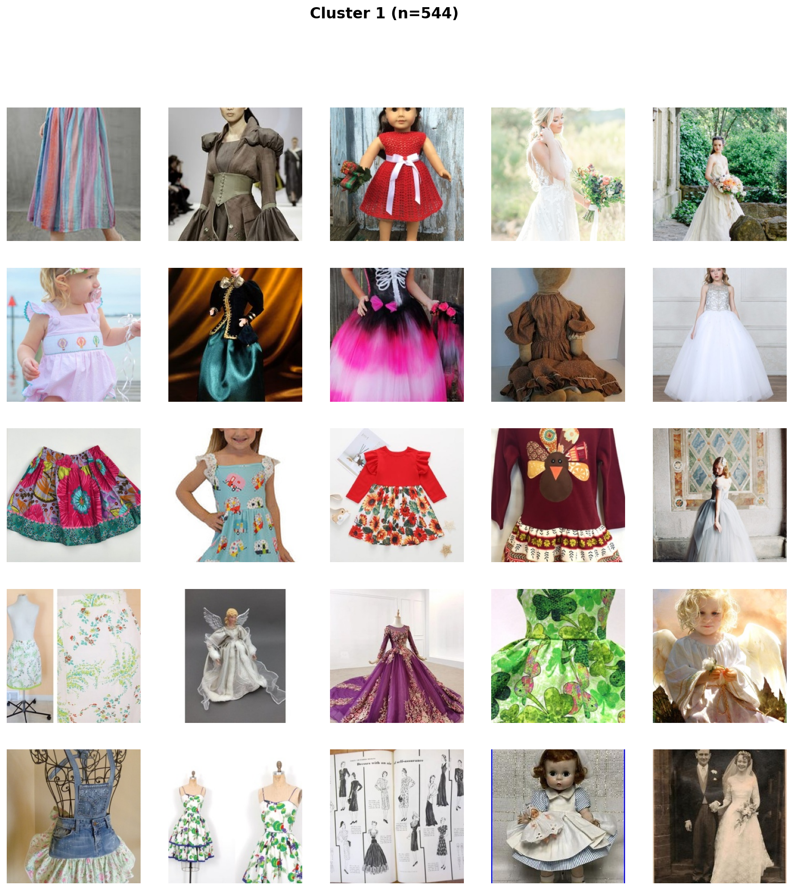
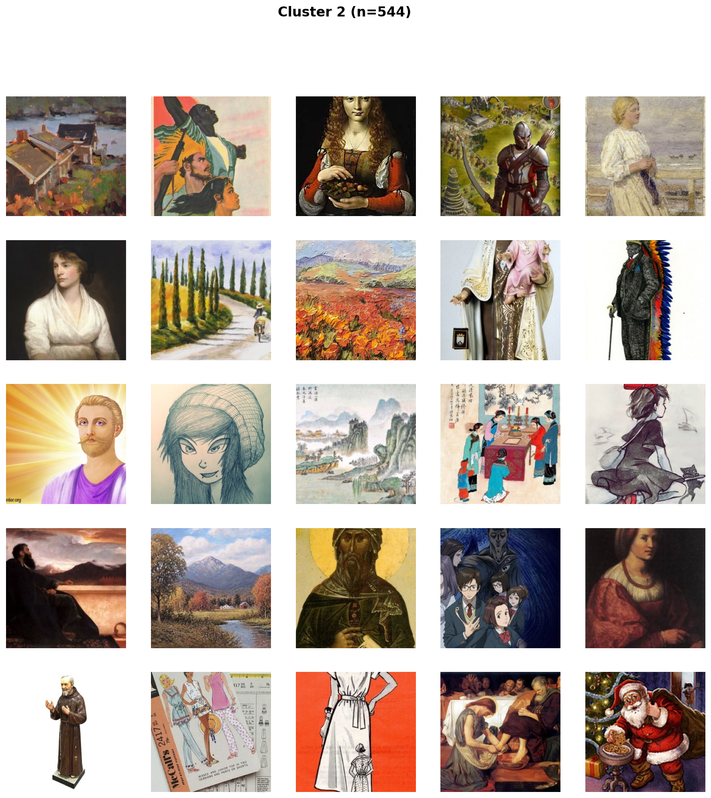
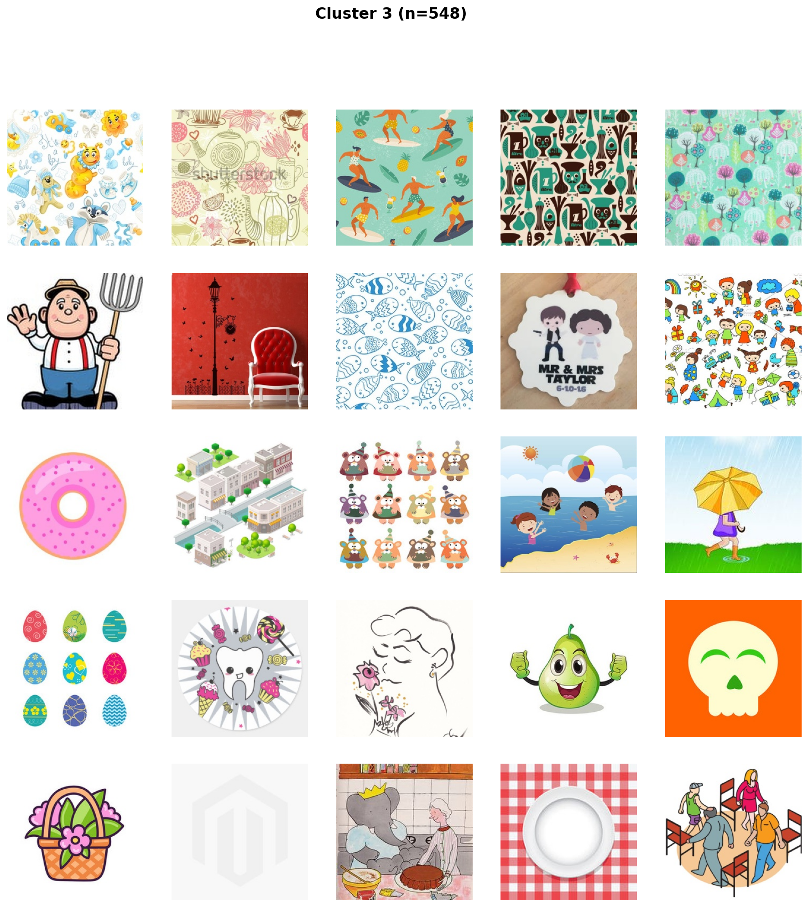
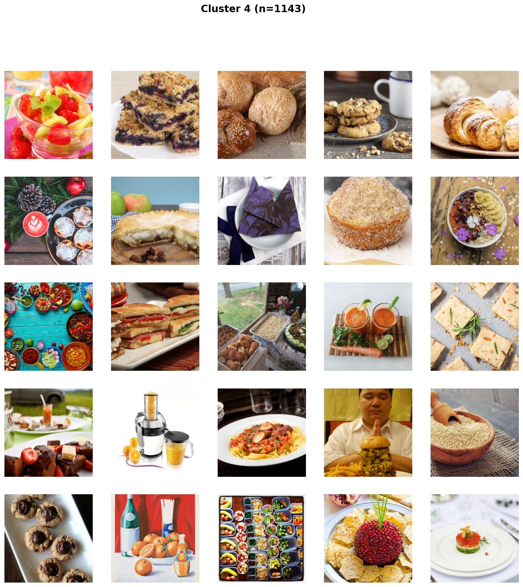
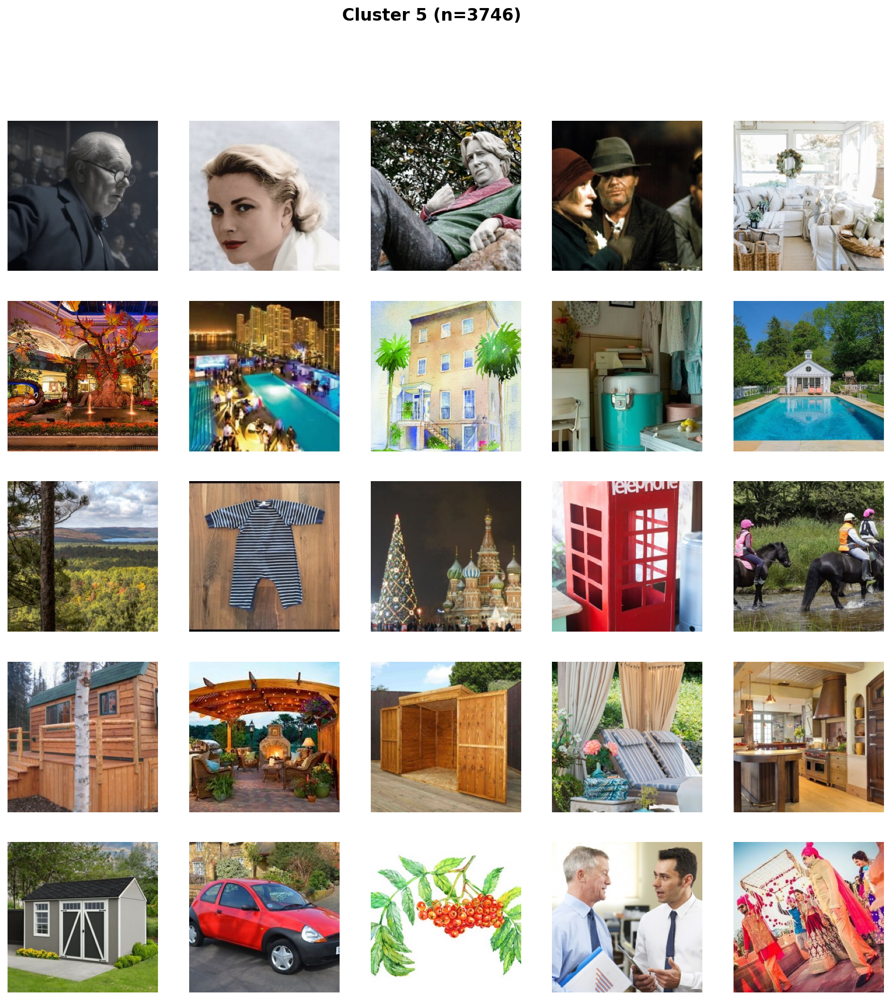
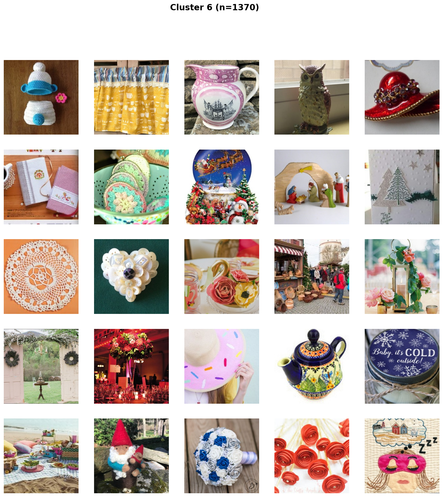
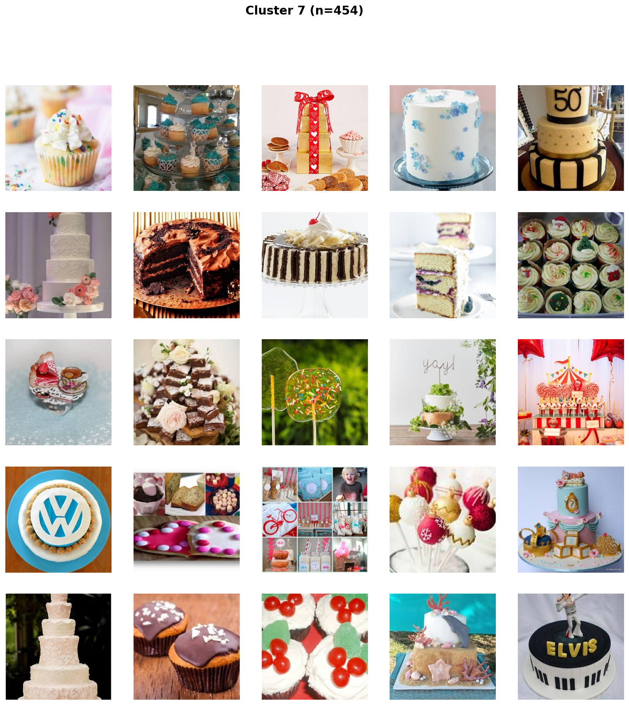
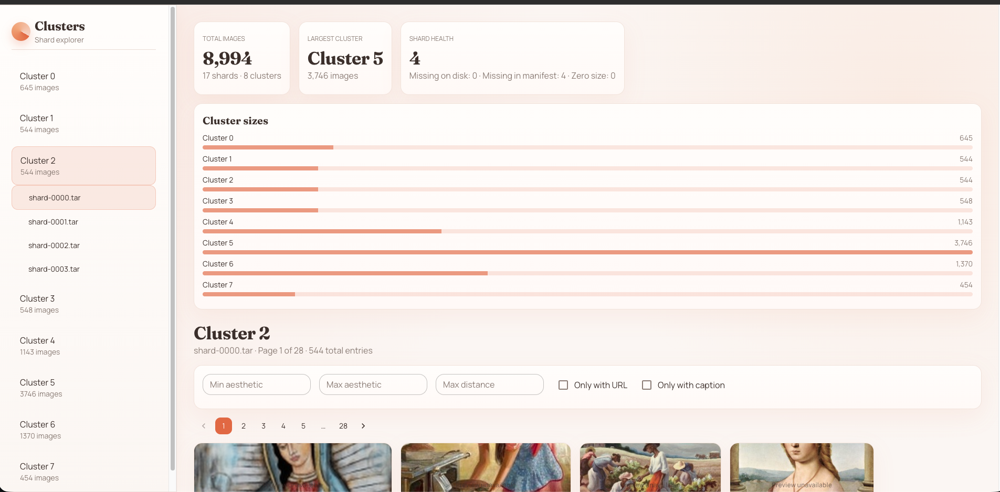
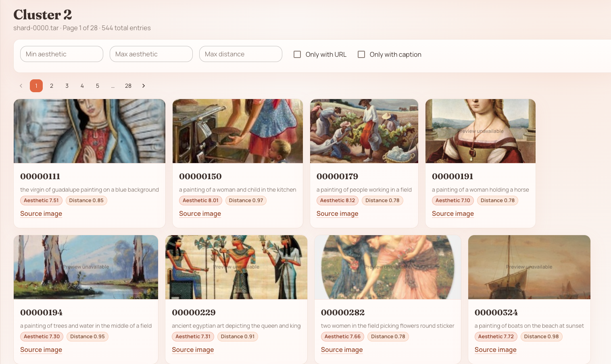

# Paris Data Pipeline - LAION to Expert Training Shards

A data pipeline that reproduces the data preparation strategy behind [Bagel Labs' Paris model](https://arxiv.org/abs/2510.03434) at demo scale.

Paris trains 8 independent diffusion experts in complete isolation (no gradient sync, no parameter sharing) on semantically clustered data. The paper validates at two scales: DiT-B/2 (129M params per expert, 1.03B total) and DiT-XL/2 (605M per expert, 4.84B total). This pipeline produces everything needed to train both the experts and the post-hoc router: VAE latents, CLIP text embeddings, DINOv2-clustered partitions, and router supervision data.

## Intro

I came across the Paris paper (arXiv:2510.03434) from Bagel Labs while reading about decentralized training approaches. What caught my attention was the data side: Paris clusters its training set using DINOv2 embeddings and conditions generation on CLIP ViT-L/14 text embeddings, with images encoded to 32x32x4 latents. The whole thing falls apart if the clustering is bad or the preprocessing is sloppy - eight experts are only as good as the eight partitions they train on.

So I built a pipeline to understand that end-to-end. Not at Paris scale (11M images, 120 A40 GPU-days), but at 10k images on a Kaggle T4 x2 instance - enough to validate every stage and hit real edge cases. The pipeline covers ingest, quality filtering, BLIP-2 captioning, CLIP/DINOv2 embedding, K-means clustering, VAE encoding, and WebDataset sharding. See Results for metrics.

### Deviations from Paper

| Aspect | Paris | This Pipeline |
|--------|-------|---------------|
| DINOv2 variant | ViT-L/14 (1024-d) | ViT-base (768-d) - compute tradeoff at demo scale |
| Captioning | Uses existing LAION alt-text | Adds BLIP-2 re-captioning (alt-text is noisy) |
| Clustering | Two-stage hierarchical K-means | Single-pass K-means(K=8) - simplification |

## Pipeline

```
LAION-Aesthetic (10k images)
        │
   01_ingest ──── img2dataset download
        │
   02_filter ──── quality + NSFW + perceptual dedup (pHash)
        │
   03_caption ─── BLIP-2 captions + CLIP ViT-L/14 text embeddings
        │
   04_cluster ─── DINOv2-base embeddings → K-means (K=8)
        │
   05_validate ── silhouette score, visual grids, cluster report
        │
   06_encode ──── sd-vae-ft-mse → 32×32×4 latent tensors
        │
   07_shard ───── per-cluster WebDataset .tar + router training pairs
        │
   outputs/
   ├── expert_shards/cluster_{0-7}/*.tar
   ├── router_training/{latents,cluster_labels,image_ids}.npy
   ├── router_training/{dinov2_embeddings,clip_text_embeddings}.npy
   └── pipeline_manifest.json
```

## Architecture Alignment

| Paris needs | This pipeline produces |
|---|---|
| 32×32×4 VAE latents per expert | Per-cluster WebDataset shards with pre-encoded latents |
| CLIP ViT-L/14 text conditioning | Pre-computed CLIP text embeddings in every shard |
| 8 semantic partitions (DINOv2) | K-means on DINOv2-base embeddings (see note on variant above), validated with silhouette score |
| Router training data | `(latent, cluster_label)` pairs exported as `router_training/latents.npy` + `router_training/cluster_labels.npy` (the Paris router adds noise/timesteps during its own training loop) |

## Quick Start

```bash
pip install -r requirements.txt

# Full pipeline
python run_pipeline.py

# Resume from a specific stage (e.g., after session timeout)
python run_pipeline.py --resume-from 4

# Run specific stages only
python run_pipeline.py --stages 4,5

# Validate config without running
python run_pipeline.py --dry-run
```

**Kaggle (recommended)**: Create notebook → enable GPU T4 x2 → upload project → run.

> Stage 1 streams `laion/laion2B-en-aesthetic` as a proxy for the LAION-Aesthetic data used by Paris. The paper's exact 11M subset selection criteria are not publicly documented. You can adjust `laion_index_*` in `config.yaml` to change the source.

## Results

Pipeline run on 10,000 LAION-Aesthetic images (Kaggle T4 x2). 8,994 images survived filtering (53 NSFW, 49 duplicates). Total wall time: ~38 minutes.

### Pipeline Metrics

| Stage | Detail | Time |
|-------|--------|------|
| Ingest | 9,096 / 10,000 downloaded (904 dead URLs) | 7.2 min |
| Filter + Dedup | 8,994 retained (53 NSFW, 49 pHash dupes) | 2.8 min |
| Caption + CLIP | BLIP-2 captions + CLIP ViT-L/14 embeddings | 20.5 min |
| Cluster | DINOv2-base → K-means(8) | 3.0 min |
| Validate | Silhouette, D-B, grids | 0.2 min |
| Encode | sd-vae-ft-mse → 32×32×4 fp16 latents (70 MB) | 4.4 min |
| Shard | 13 WebDataset .tar shards | 0.3 min |

### Cluster Quality

| Metric | Value |
|--------|-------|
| Silhouette score | 0.0425 |
| Davies-Bouldin index | 5.0757 |

Silhouette of 0.0425 reflects the diversity of LAION-Aesthetic with K=8. Cluster 5 acts as a catch-all for general photography (41.6% of data), pulling the global score down. The tighter specialized clusters (0, 1, 2, 3, 7) show intra-cluster cosine similarity of 0.17–0.30, indicating meaningful semantic separation.

### Cluster Distribution

| Cluster | Dominant Content | Samples | Fraction |
|---------|-----------------|---------|----------|
| 0 | Cars & vehicles | 645 | 7.2% |
| 1 | Dresses & fashion | 544 | 6.0% |
| 2 | Paintings & fine art | 544 | 6.0% |
| 3 | Illustrations & clipart | 548 | 6.1% |
| 4 | Food & beverages | 1,143 | 12.7% |
| 5 | General photography (catch-all) | 3,746 | 41.6% |
| 6 | Crafts & decorative objects | 1,370 | 15.2% |
| 7 | Cakes & confections | 454 | 5.1% |

## Visualizations

### Cluster Grids

5x5 sample grids per cluster:

| | |
|---|---|
|  |  |
|  |  |
|  |  |
|  |  |

### VAE Reconstruction Verification

Side-by-side originals vs decoded latents:


## Shard Viewer

I built a shard viewer tool (FastAPI + React) to browse the pipeline outputs interactively. It reads the WebDataset tar files directly and provides:

- **Cluster overview dashboard** with total images, shard counts, and size distribution
- **Health checks** to spot missing, extra, or zero-size shard files
- **Filtering** by aesthetic score, cluster distance, or whether entries have a URL/caption
- **Paginated browsing** with images streamed directly from raw files (fallback to shards)
- **Entry detail modal** with larger preview, captions, scores, and source URL

This is how I originally caught leftover shards from run #1 that weren't reflected in the manifest (see "What I Learned" below). I later fixed this by making Stage 7 clean existing shard outputs by default.




## Scaling Notes

| Concern | 10k (demo) | 11M (Paris scale) |
|---------|-----------|-------------------|
| Clustering | sklearn K-means in-memory | faiss GPU K-means |
| Captioning | BLIP-2 is the slow part | If you keep re-captioning, this dominates. Paris does not require this step. |
| Storage | ~6 GB local (raw + intermediates + shards) | ~1-2 TB on object storage (rough estimate), stream via WebDataset |
| Orchestration | `run_pipeline.py` | Prefect/Airflow DAG |

**What breaks first at 11M**: sklearn K-means. 11M × 1024 float32 is about 43 GB of embeddings (assuming DINOv2-ViT-L/14 like the paper), and that is before you do anything useful with them. Use faiss.

## Interesting findings / thoughts

Building this pipeline forced me to separate two concerns: the practical mechanics of preparing data for distributed expert training, and the broader research question of whether zero-communication training is a viable paradigm for diffusion models.

**The efficiency angle is what drew me to this project.** The paper's claims around compute and data efficiency (14x less data, 16x less compute vs. prior decentralized baselines) represent exactly the kind of research I find exciting: rethinking fundamental assumptions about how distributed training has to work. Zero-communication is a bold departure from synchronized approaches like DDP and FSDP, and if the approach holds, it could genuinely democratize large-scale training.

**If communication disappears, clustering becomes the contract.** In this architecture, the "coordination" shows up entirely in the partitioning step: good clusters create experts with clean specialties; bad clusters strand capacity in the wrong shard, and the router cannot compensate after the fact. Building this pipeline gave me direct experience with that constraint.

### Engineering Reality Check (What Actually Broke)

**Connection reliability.** Streaming directly from LAION kept dropping connections, so I switched to downloading 200k rows upfront and sampling from there, which made the ingest stage reliable.

**Aesthetic score metadata gap.** The aesthetic score column was missing from the initial metadata pull, which meant every shard came out with aesthetic 0.00 across the board. I fixed that by pulling the column through properly and re-running.

**Leftover shards from previous runs.** After the re-run, I noticed 4 out of 17 total shard files on disk still had zeroed aesthetic scores. These were leftover shards from the first run that still carried the old metadata. They had full data (latents, embeddings, captions), just zeroed aesthetic scores. At the time, the sharding script (`07_shard.py`) didn't clean previous `.tar` outputs before writing new ones, so the 4 leftover files coexisted with the 13 correct shards from run #2. The shard viewer's health checks are what caught this. I fixed this by making Stage 7 clean existing shard outputs by default (`clean_expert_shards: true`). There is also a possibility that some LAION records simply don't have aesthetic scores attached; to close the loop I'd either compute aesthetic scores using LAION's predictor or re-run with stricter metadata validation.

**Shard viewer as a debugging tool.** The FastAPI + React viewer (above) started as a quick debugging tool but ended up being the fastest way to audit data quality without writing throwaway scripts. It caught the leftover shard issue and made it easy to spot patterns in the cluster assignments.

**Potential extensions:** close the aesthetic score gaps via LAION's predictor, and publish the cleaned dataset on Hugging Face.

## Project Structure

```
├── config.yaml              # All pipeline parameters
├── run_pipeline.py          # Orchestrator with --resume-from
├── scripts/
│   ├── 01_ingest.py         # LAION-Aesthetic download
│   ├── 02_filter.py         # Quality filtering + dedup
│   ├── 03_caption.py        # BLIP-2 + CLIP text embeddings
│   ├── 04_cluster.py        # DINOv2 → K-means(8)
│   ├── 05_validate_clusters.py  # Cluster quality metrics + grids
│   ├── 06_encode_latents.py # VAE → 32×32×4 latents
│   └── 07_shard.py          # WebDataset shards + router data
├── utils/
│   ├── helpers.py           # Config, checkpoints, I/O
│   ├── logging_config.py    # Structured logging
│   └── validation.py        # Inter-stage validation
└── analysis/                # Generated cluster reports and grids
```

## References

- [Paris: A Decentralized Trained Open-Weight Diffusion Model](https://arxiv.org/abs/2510.03434) - Bagel Labs
- [LAION-Aesthetic](https://laion.ai/blog/laion-aesthetics/)
- [DINOv2](https://arxiv.org/abs/2304.07193) - Meta AI
- [sd-vae-ft-mse](https://huggingface.co/stabilityai/sd-vae-ft-mse) - Stability AI
- [CLIP ViT-L/14](https://github.com/openai/CLIP) - OpenAI
